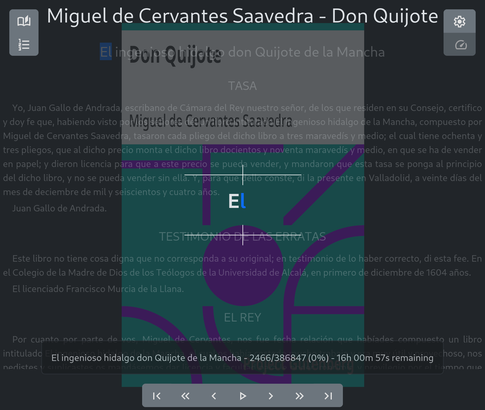

# Sadok

Online e-book reader




You can test Sadok with the [online version](https://babelouest.github.io/sadok).

## Available modes

### Speed reading

Read the e-book using a speed reading mode: one word at a time on the center of the screen with Optimal Recognition Point technique.

Speed and other options can be configured in the `Parameters` Menu.

### Text-to-speech reading

Read the book using the [speech synthetisis](https://developer.mozilla.org/en-US/docs/Web/API/SpeechSynthesis) API on the browser.
Beware of the speech synthetisis, there is no emotion, no change of rythm, no change of tone. It's not as good as a real audio book read by a human.

Voice settings and other options can be configured in the `Parameters` Menu.

### By-sentence reading

Read a e-book one sentence at a time.

## Save configuration, book read and position

The position of the reading and your configuration is saved either in the local storage on your browser, or on your remote profile if you use a profile server. **The profile server isn't safe, so it must be used in a controlled environment like an intranet or a VPN.**

## Document format supported

### ePub

Parses electronic books in ePub format using the library [foliate-js](https://github.com/johnfactotum/foliate-js), renders the html content and the images of the book.

### PDF

Parses the text content of PDF files using [PDF.js](https://mozilla.github.io/pdf.js/), renders only the text, not the style, nor the images.

### Text

Parses a text file.

## Usage

Open the application on your browser, see the [online version](https://babelouest.github.io/sadok) for example.

Open an e-book, select a reading mode. When ready click on the `start reading` button, click on the displayed text or on the background text, the speed reading mode will start. To stop the reading mode, click on the screen.

## Build and install

### React web application

On the `sadok/webapp-src/` directory, install the dependencies and build the application using npm:

```shell
$ npm install   # install the dependencies
$ # make your modification in the public/ or the src/ directories
$ npm run build # build the application
```

The built js files will be located in the `sadok/webapp-src/dist/` directory.

To install your modify the web app, run the command `npm run install`, this will install the `sadok/webapp-src/public/*` files and the `sadok/webapp-src/dist/*` files and folders in the `sadok/doc/` directory.

### Add a catalog files for your e-books

The content of your local hosted library can be listed in the file `sadok/doc/list.json`. The content of the file has the following format:

```javascript
[
  {
    "title": "Jules Verne - De la Terre à la Lune",          // Displayed title in the browse section
    "type": "epub",                                          // file type (epub, pdf or txt)
    "url": "books/Jules Verne - De la Terre à la Lune.epub", // url of the file, relative to the web app url, or absolute
    "size": 220716,                                          // file size (optional)
    "date": "2026-07-10T19:12:24.948Z"                       // file date (optional)
  },
  {
    "title": "Miguel de Cervantes Saavedra - Don Quijote",
    "type": "epub",
    "url": "books/Miguel de Cervantes Saavedra - Don Quijote.epub",
    "size": 919284,
    "date": "2026-07-10T19:14:26.808Z"
  },
  {
    "title": "Other", // To navigate in virtual subdirectories
    "type": "dir",
    "content": [
      {
        "title": "Lewis Carroll - Alice in Wonderland",
        "type": "epub",
        "url": "books/Lewis Carroll - Alice in Wonderland.epub",
        "size": 189199,
        "date": "2026-07-10T19:11:53.944Z"
      }
    ]
  }
]
```

### Add a profile server

If you want to use a profile server to share your profiles between devices, your profile API must be available under the url `api/` url relative to the web app. Examples of profile servers are available in the [profile-server](profile-server) directory. Beware that a profile server has no security or authentication, they must not be available in untrusted networks.

## Copyright

2026 Nicolas Mora <mail@babelouest.org>

License: AGPL
